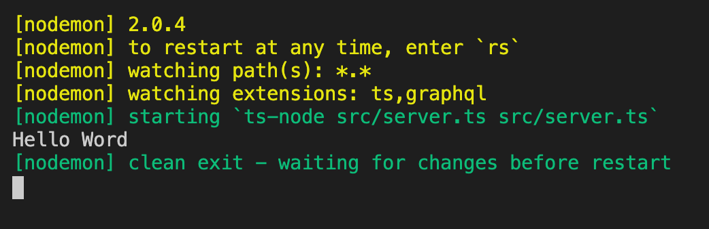
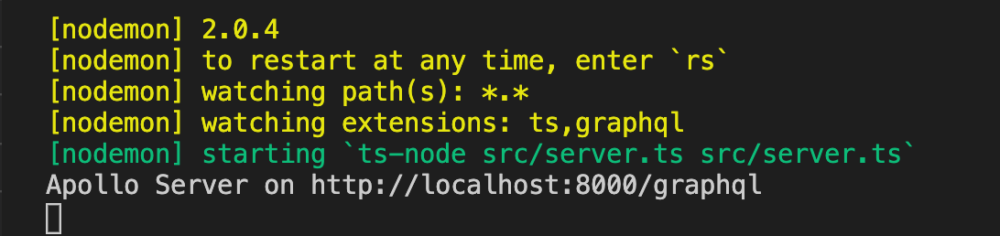
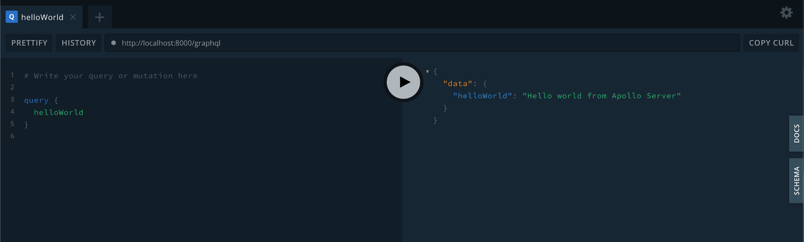

In this article, we are going to see how to build a Nodejs GraphQL API with TypeScript using Apollo Server Express.

I conducted a workshop for beginners who want to write GraphQL APIs using Typescript and Nodejs.

---

If it feels boring reading lots of words one by one and you can understand Hindi a bit. You can watch video tutorials for this.
Video tutorials are available on my [YouTube Channel](https://www.youtube.com/channel/UCalpz0wG0xvNXcVYasg1pEA) as [Playlsit](https://www.youtube.com/playlist?list=PLt7lRnT2c5QTdzvHgKybuMankvw855qMW).

<iframe width="1192" height="670" src="https://www.youtube.com/embed/mAFPj-leaMw" frameborder="0" allow="accelerometer; autoplay; clipboard-write; encrypted-media; gyroscope; picture-in-picture" allowfullscreen></iframe>

---

Let's understand a few terminologies before actually diving into the code.

### Node.js

- Node.js is a platform built on Chrome’s JavaScript runtime for easily building fast and scalable network applications.
- Node.js uses an event-driven, non-blocking I/O model that makes it lightweight and efficient, perfect for data-intensive real-time applications that run across distributed devices.
- [More document about node.js is here](https://nodejs.org/en/docs/).

### Apollo Server

- Apollo Server is an [open-source](https://github.com/apollographql/apollo-server), spec-compliant GraphQL server that’s compatible with any GraphQL client, including [Apollo Client](https://www.apollographql.com/docs/react).
- It’s the best way to build a production-ready, self-documenting GraphQL API that can use data from any source.
- [Read more about Apollo Server here](https://www.apollographql.com/docs/apollo-server/).

##### You can use Apollo Server as:

- A stand-alone GraphQL server, including in a serverless environment
- An add-on to your application’s existing [Node.js middleware](https://www.apollographql.com/docs/apollo-server/integrations/middleware/) (such as Express or Fastify)
- A gateway for a [federated data graph](https://www.apollographql.com/docs/apollo-server/federation/introduction/).

##### Apollo Server provides:

- **Straightforward setup**, so your client developers can start fetching data quickly
- **Incremental adoption**, allowing you to add features as they’re needed
- **Universal compatibility** with any data source, any build tool, and any GraphQL client
- **Production readiness**, enabling you to ship features faster.

### Express

- **Express** is a routing and middleware web framework that has minimal functionality of its own: An Express application is essentially a series of middleware function calls.
- [Read more about express here](https://expressjs.com/en/guide/using-middleware.html)

### TypeScript

- TypeScript is JavaScript that scales.
- Because TypeScript is a superset of JavaScript, it doesn’t have a default template — there would be too many. Instead, other projects have their own TypeScript bootstrap templates with their own context.

**Why use TypeScript over JavaScript?**

If an experienced developer is working on relatively small coding projects, then JavaScript is ideal. However, if you have the knowledge and expertise development team, then Typescript is the most preferred option. Typescript has the following advantages over Javascript.

- The powerful type system, including generics & JS features
- TypeScript uses concepts like types and interfaces to describe data being used.
- The Ecosystem is quite powerful and intuitive. Thus, it allows you to statically type various types of idiomatic JavaScript features like union types, intersection, discriminated union.
- With Typescript, many npm packages either come with static type definitions or have an external one that is easy to install.
- Typescript has a feature of prototyping.
- Early spotted bugs
- Predictability
- Readability
- Power of OOP

### Let's write code for what we are here….

**Creating a directory and working on**

```
mkdir apollo-server-demo-project
cd apollo-server-demo-project
```

**Setting up the npm project**

```
npm init — yes
```

This command will create a package.json file in the project.

**Install and initializing TypeScript for our project**

Add TypeScript to our project’s npm devDependencies

```
npm install — save-dev typescript
```

**Generate a tsconfig.json file using [npx](https://medium.com/@maybekatz/introducing-npx-an-npm-package-runner-55f7d4bd282b)**.

```
npx tsc --init --rootDir src --outDir dist --lib dom,es6 --module commonjs –removeComments
```

Running above command will create tsconfig.json file in the project and it will look like this.


We will also need [nodemon](https://www.npmjs.com/package/nodemon) to compile our code on change, and [ts-node](https://www.npmjs.com/package/ts-node) to exec TypeScript files.

Let's install these 2 dependencies as well now

```
npm i nodemon ts-node --save-dev
```

### Writing actual code now

Create a `/src` directory with a `server.ts` file and print hello world from `server.ts` file

```
console.log(“Hello World”);
```

Run below command to see the result on your terminal of project.

```
nodemon 'src/server.ts' --exec 'ts-node' src/server.ts
```

You will see **Hello World** printed on your terminal as below.



### Lets now create an actual GraphQL API

**Setting up Apollo-Server-Express**

Installing dependencies for [apollo-server-express](https://www.npmjs.com/package/apollo-server-express), [cors](https://www.npmjs.com/package/cors), [express](https://www.npmjs.com/package/express) and [graphql](https://www.npmjs.com/package/graphql)

```
npm install apollo-server-express cors express graphql
```

Installing dependencies for [@types/express](https://www.npmjs.com/package/@types/express), [@types/node](https://www.npmjs.com/package/@types/node), [graphql-tools](https://www.npmjs.com/package/graphql-tools) and [graphql-import-node](https://www.npmjs.com/package/graphql-import-node)

```
npm install @types/express @types/node graphql-tools graphql-import-node --save-dev
```

**Creating a simple schema and resolver**

In the `/src` folder, create a `/schema` folder and create a file `schema.graphql`

<script src="https://gist.github.com/AnkitDroidGit/390ef242f8c77c279449fb836e0cc116.js"></script>

Then let’s quickly create a `resolvers.ts` file in the `/src` folder

<script src="https://gist.github.com/AnkitDroidGit/0c612e3863f2b62c6d7570c774e311bf.js"></script>

Create a `schema.ts` file in the `/src` folder that will be in charge of making an Executable GraphQL Schema:

<script src="https://gist.github.com/AnkitDroidGit/127b6d94d27be9922a711d9156096b13.js"></script>

**Finally creating apollo-server**

<script src="https://gist.github.com/AnkitDroidGit/c12cc8d38653c28c81c203ba9c34e009.js"></script>

Run your server again open http://localhost:8000/graphql on browsers of any other graphql client software.



### Let's test your helloWolrd query from the client



Add scripts in your `package.json` file as below for running commands in an easier way from next time.

```
"scripts": {
"start": "node 'dist/server.js'",
"build": "tsc -p . && ncp src/schema dist/schema",
"start:dev": "npm run build:dev",
"build:dev": "nodemon 'src/server.ts' --exec 'ts-node' src/server.ts -e ts,graphql"
},
```

- Running `npm run build:dev` in your terminal will compile your code.
- You can run the compiled code with `npm start:dev`
- Running `npm run build` in your terminal will compile your code and put it in the `/dist` folder.
- You can run the compiled code with `npm start`

## Lets now create a Mutation GraphQL API

Add mutation object in `src/schem/schema.graphql` file

<script src="https://gist.github.com/AnkitDroidGit/44032e5a567c15d5f5dea197db6f32d1.js"></script>

Add some logic for resolving mutation in `src/resolvers.ts` file as shown below

<script src="https://gist.github.com/AnkitDroidGit/d7bea58a81ce5ccbc69712290a34114f.js"></script>

Run the command and test mutation from client


---

Happy learning and happy coding !!!

The code for this workshop is available as open source on [GitHub repo](https://github.com/AnkitDroidGit/Apollo-Server-Workshop).

---

I have tried to share some of the lessons that I have learned from various sources. I will continue to keep learning more and sharing more. I hope it helps someone and makes their life a bit easier.

Also, to be notified about my new articles and stories, follow me on [Medium](https://ankitdeveloper.medium.com/), [Github](https://github.com/AnkitDroidGit), and [Twitter](https://twitter.com/KumarrAnkitt). You can find me on [LinkedIn](https://www.linkedin.com/in/kumarankitkumar/) as well. I am quite active on [Dev Community](https://dev.to/ankitkumar) as well and write small topics over there.

Cheers!!!!
